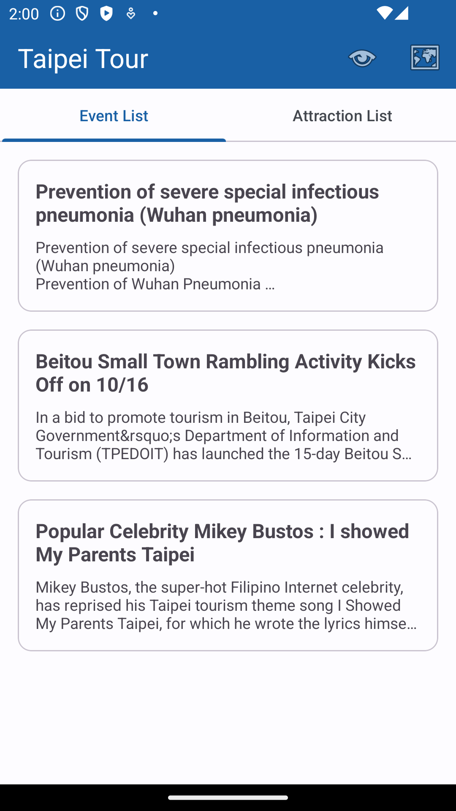
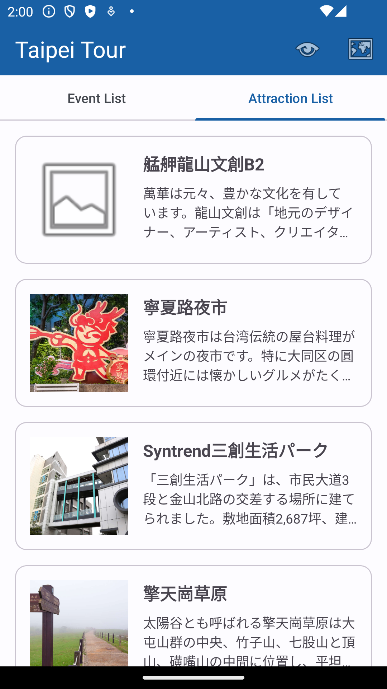
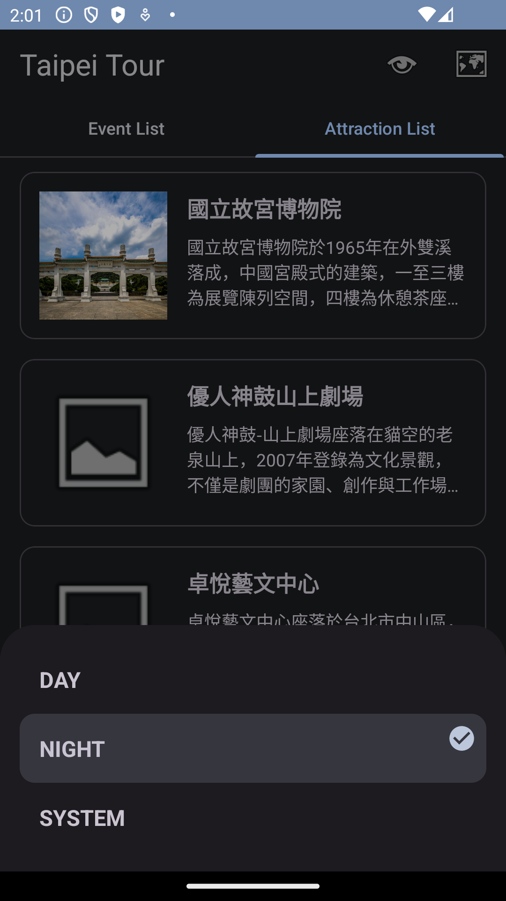
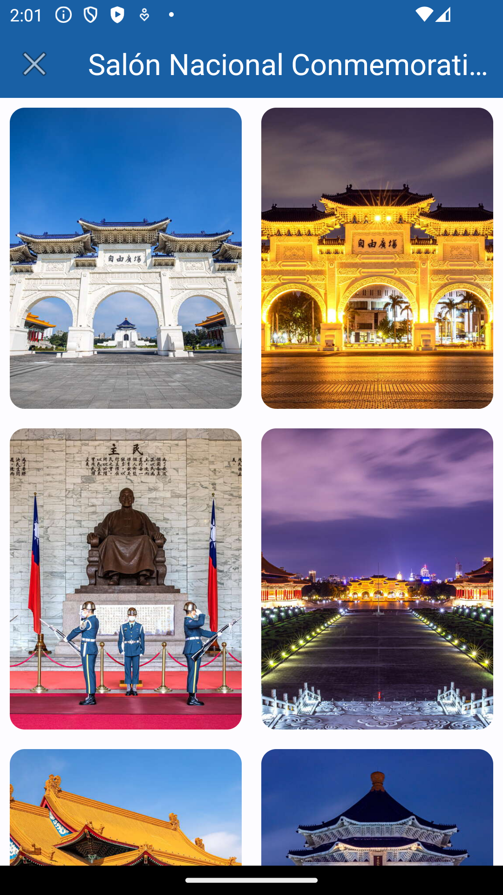

# TaipeiTour

A sample project to demonstrate the practices of the Android app architecture illustrated below.

To see the related medium article, checkout the [`Android Application Architecture Showcase : Sunflower Clone`](https://medium.com/@b9915034/android-application-architecture-showcase-sunflower-clone-dee729f6e1f2).

## Screenshots

 &nbsp;
 &nbsp;
 &nbsp;
 &nbsp;
 &nbsp;
 &nbsp;

## Architecture Overview

## Features

* Dark Mode
* CollapsingToolbarLayout
* Kotlin
* Image Viewer with zoom in and zoom out capabilities
* Material 3
* MVVM
* Language Settings
* Supports offline functionality
* Paging 3
* Single State View Model
* Unidirectional Flow
* Unit tests implemented in the Data Layer and Core Layer
* ViewPager2

## Api Reference

https://www.travel.taipei/open-api/swagger/ui/index#/Attractions/Attractions_All
