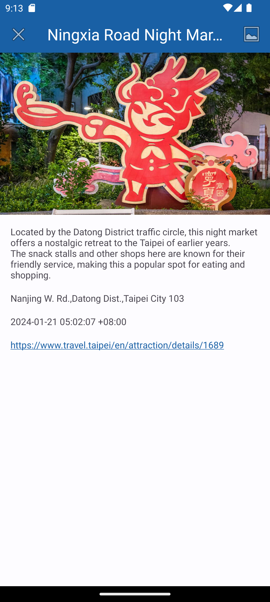

# TaipeiTour

A sample project to demonstrate the practices of the Android app architecture illustrated below.

To see the related medium article, checkout the [`Android Application Architecture Showcase : Sunflower Clone`](https://medium.com/@b9915034/android-application-architecture-showcase-sunflower-clone-dee729f6e1f2).

## Screenshots

 &nbsp;
 &nbsp;
 &nbsp;
 &nbsp;
 &nbsp;

## Features

This example shows how to build an Android project based on the app architecture.
Please see the links below to understand this topic better.

[Guide to app architecture](https://developer.android.com/topic/architecture)

[Guide to Android app modularization](https://developer.android.com/topic/modularization)

## Api References

https://www.travel.taipei/open-api/swagger/ui/index#/Attractions/Attractions_All
